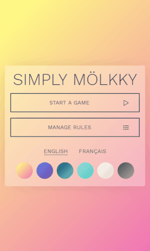

# Simply Mölkky
Simply Mölkky is an app to keep track of scores in a game of **Mölkky**.

[](https://simply-molkky.com)

## Motivation
It's really hard to calculate Mölkky scores in your head and to keep track of all scores. This App is here to help your Mölkky player's life.
This App is also a good project to learn Vue.js on a real life problem.


## Build status

[](https://travis-ci.org/coming-soon/coming-soon)

> Coming soon :)

## Code style

[](https://vuejs.org/v2/style-guide/)
[](https://github.com/airbnb/javascript)

## Screenshots

> Coming soon :)

## Tech/framework used
Simply Mölkky is built with [Vue.js](https://vuejs.org/v2).

**Vue.js plugins :**
- [vue-router](https://github.com/vuejs/vue-router)
- [vue-i18n](https://github.com/kazupon/vue-i18n)
- [vuex](https://github.com/vuejs/vuex)
- [vuex-persistedstate](https://github.com/robinvdvleuten/vuex-persistedstate)
- [Vue.Draggable](https://github.com/SortableJS/Vue.Draggable)

## Features
Simply Mölkky allow you to :
- Customize some Mölkky rules
- Manage players (add, remove, sort, shuffle) for a game
- Play a Mölkky game (manage scores, penaltys, eliminations)

## Installation

### Requirements

This project need [`@vue/cli`](https://github.com/vuejs/vue-cli) package to be installed globaly. If it's not run the following command :
``` bash
yarn global add @vue-cli
# or using npm
npm install -g @vue/cli
```

### Run development env

``` bash
# install dependencies
yarn install
# serve locally
yarn serve
```

## Tests
Unit tests and e2e tests can be run :

``` bash
# run unit tests
yarn test:unit
# run end to end tests
yarn test:e2e
```

## Contribute

Let people know how they can contribute into your project. A [contributing guideline](https://github.com/zulip/zulip-electron/blob/master/CONTRIBUTING.md) will be a big plus.

## Credits
Give proper credits. This could be a link to any repo which inspired you to build this project, any blogposts or links to people who contrbuted in this project.

#### Anything else that seems useful

## License
A short snippet describing the license (MIT, Apache etc)

MIT © [Yourname]()
